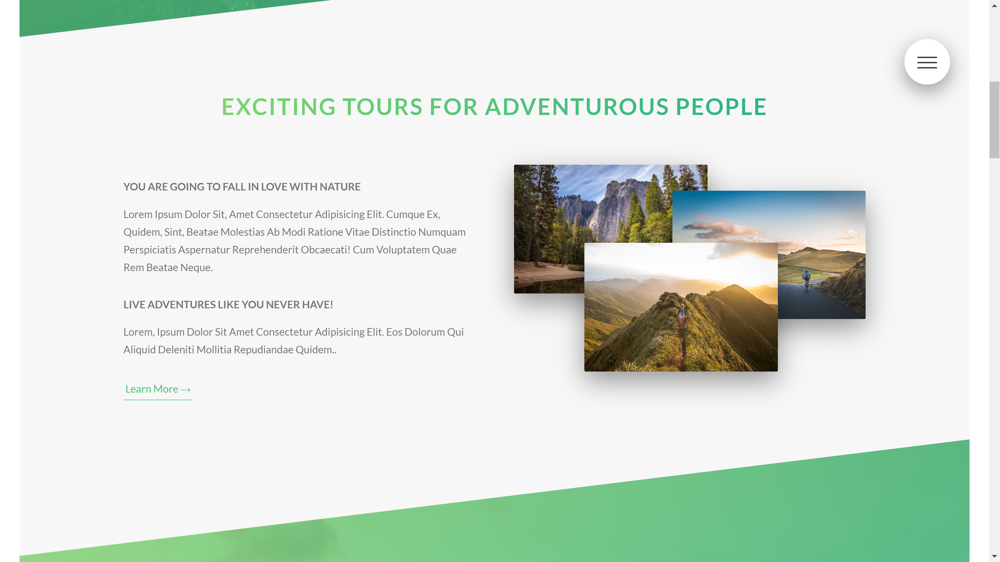

# Natours
This repository contains the code for the landing page of **Natours**.  
This website is built using `SASS` and `PostCSS` and `Autoprefixer`. The site is completely responsive and uses `CSS Media Queries` to be responsive.  

You can view the site here [here](https://varunguttikonda.github.io/Natours).  

## Screenshots

